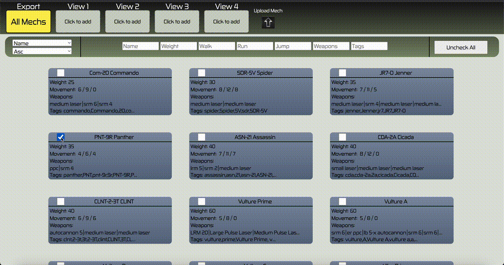

# MechMarkup

This site utilizes Mongo databases and session tracking to implement a mobile friendly site/application that is used to "Markup" BattleTech Mech Record sheets. I wanted a better way to manage the multiple record sheets I was using for BattleTech and this method seemed like a natural fit.

# Overview

I've developed other sites that allow customization of BattleMechs but this application is more centered towards management of those mechs once you hit the tabletop. It includes options for maintaining record sheets in the same view, zoom capability for different sections of the record sheet, and different markup options to make it easier to manage these while playing.

## Getting Started



### Dependencies

-   Docker Desktop

### Installing

-   cp .env.example .env (modify as needed)
-   docker compose down -v
-   docker compose build --no-cache
-   docker compose up -d

### Executing program

-   Navigate to your local browser
-   Step-by-step guide below

```
Navigate to http://localhost:8090/

Data will be saved automatically as you make changes
```

## Authors

[@NateThurmond](https://github.com/NateThurmond)

## Version History

-   0.4
    -   Docker migration for ease of use
-   0.3
    -   Allow upload of custom record sheets and export of marked up sheets
    -   Add vehicle and elemental record sheets
-   0.2
    -   Added auto-save capability for markup changes
    -   See [commit change](https://github.com/NateThurmond/MechMarkup/commits/master/) or See [release history](https://github.com/NateThurmond/MechMarkup/releases)
-   0.1
    -   Initial Development

## License

This project is licensed under the Apache License, Version 2.0

## Acknowledgments

Inspiration, code snippets, etc.

-   [Camo Specs](https://camospecs.com/)
-   [Solaris Skunk Werks](https://solarisskunkwerks.com/)
-   [BattleTech](https://www.battletech.com/)
